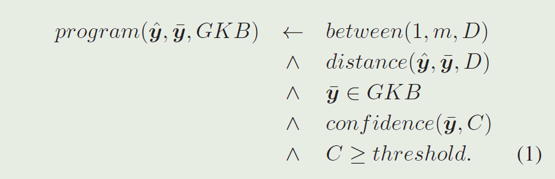
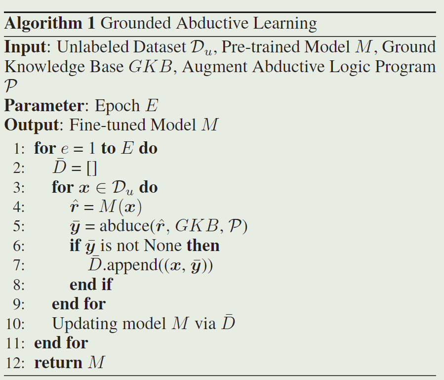

# Abductive Learning with Ground Knowledge Base

## Problem

如何在ABL中将ground truth显式地表达或者获取为一阶逻辑具有挑战性。

## Goal

提出一种GABL新框架，改进了ABL。使其能够通过少量的标签来增进机器学习模型效果

- 减少了人工标签的需求
- 提升模型性能

## Proposed Approach

### 通过GKB约束pseudo-labels

通过公式1计算模型预测的结果$\hat{y}$和知识库GKB中的事实$\bar{y}$的相似度，如果接近就保留，作为机器学习训练的标签。如果不接近就丢弃。

### Empirical Study

设置阈值$p_t$，

- 如果机器学习模型准确率高了，就用推理得到的标签训练模型，提升性能。
- 如果机器学习准确率低，就用ground-truth进行训练。

## Conclusion

逻辑推理的模块可以提升预训练模型的准确率，使其超过一定的阈值。但是这个阈值取决于GKB的大小和ground truth的稀疏程度。这篇文章证明了可以将ground truth转换成一阶逻辑，并且用于ABL中